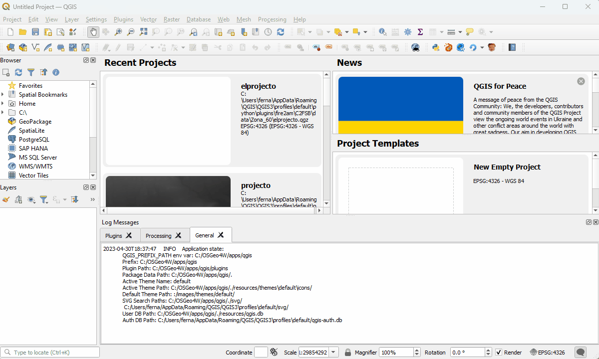

        Fire Advanced Analytics & Management
        
                 fire2am QGIS plugin
                
            by fire2a.com research centre

This repo contains a  [QGIS plugin](https://plugins.qgis.org/) for graphically interfacing with [Cell2Fire Scott & Burgan](https://github.com/fire2a/C2FSB) forest fires simulator, test cases and a few extras.  

The softwares enables you to simulate thousand of forest fires on any landscape inside [QGIS](https://qgis.org). 

With the bare minumiun input being a fuel. Other spatial inputs can include an elevation layer; canopy base height, bulk density or fraction cover; ignition points, weather scenarios, moisture content, etc.

A cup-of-coffee run length is less than 500x500 raster with 50 simulations (simulations run in parallel, the maximum number of simultaneous runs can be adjusted via number of threads on the 'Optional Rules' tab) 

Provides several outputs, such as 'Betweenness Centrality'; Fire scars: starting points, animated isochrones, probability maps. Also Crown fire scar and fuel consumption. Flame lenght, Byram intensity, Hit Rate of Spread, etc. Spatial outputs are stored as geopackages and numerical statistics are shown on the 'Tables' tab.  

[Install](#installation) then, choose your guide:
- [User](readme_user.md)
- [Expert](readme_dev.md)

_Most sections have a .gif animation at the end summarizing it._

# Installation
Overview (keep reading don't do this right away):
- Ask the fire2a team for a zip file or access to the repository
- pip install python required packages (on QGIS python environment)
- Move the source folder to QGIS's plugins directory
- Activate inside QGIS

Choose your platform:
- [Linux](#linux)🗽
- [Windows](#windows)💩  
- [MacOS](#linux)🤡

## Windows
If you don't want to reinstall QGIS and understood the [overview](#installation), you can [manually install](#windows_manual).  
 1. Install QGIS, using OSGeo4W net installer  
    - https://qgis.org/en/site/forusers/alldownloads.html#osgeo4w-installer  
    - Use default options for everything but
    - Select packages to install "QGIS desktop" & "pip"
 2. At least open and close QGIS once
 3. Download & un7zip the latest [release](https://github.com/fdobad/fire2am-qgis-plugin/releases) into `fire2am` (default suggested name)  
 5. Inside `fire2am`, double click on `install_windows.bat`, a command prompt will launch and a warning dialog will rise.
    - Click on 'More info' > 'Run anyway' on the warning dialog
    - If anything fails, run the `install_debug.bat` and [report back](#windows_debug).
 6. [Enable the plugin inside QGIS](#activate)

| select package dialog : pip |
| --- |
||
| select package dialog : qgis desktop |
||
| extracting zip, clicking installer_windows.bat, avoiding 'windows protected your pc' dialog |
|  |
| 2nd time doesn't complain. Did all outputs looked successful?  |
|  |

### Windows_debug
If any output looks like a failure message run `installer_debug.bat` and let us now the output.  
Copy the output from the command prompt window by:  
        1. Selecting the text (left-click then select)  
        2. Copy it by pressing the secondary mouse button (right button)  
        3. Paste it into an email for the fire2a team or [create an issue](https://github.com/fdobad/fire2am-qgis-plugin/issues)  
The installer checks only for these errors: "Qgis Environment failed", "Upgrading pip tools failed" & "Installing python packages failed".  
The most common error is a `ModuleNotFoundError`, after [activation](#activate) meaning something silently failed installing pip packages (this will be automated on QGIS 3.8)  

### Windows_manual 
- If pip is not installed, launch OsGeo4W Setup then install pip component:  
        1. 'win' button, type 'osgeo4w-setup'  
        2. As seen on 'select package dialog : pip' image above  
- Launch osgeo console, upgrade pip then install requirementes:  
        1. 'win' button, type 'osgeo4w shell'  
        2. `pip install --upgrade pip setuptools wheel`, if pip fails `python3 -m pip --upgrade pip`  
        3. `pip install -r C:\path\to\fire2am\requirements.txt`  
- Move the source folder into QGIS's plugins directory `%APPDATA%\QGIS\QGIS3\profiles\default\python\plugins\fire2am`  
- [Enable the plugin inside QGIS](#activate)  

Take me back to [Windows💩 install instructions](#windows)

## Linux
0. Install QGIS  
    - Debian LTR version: Super Key > type 'QGIS' > Click Install
    - Others: https://qgis.org/en/site/forusers/alldownloads.html#linux
    - MacOS🤡: https://qgis.org/en/site/forusers/download.html#mac
1. Donwload a release, unzip into the plugins folder `~/.local/share/QGIS/QGIS3/profiles/default/python/plugins/fire2am`
2. `cd` into it  
3. Python requirements  
    ```
    pip install --upgrade pip wheel setuptools
    pip install -r requirements.txt
    ```  
    __Optionally__ a virtual environment can be used, but you must remember to activate it before launching QGIS, for example `$ source ~/pyenv/qgis/bin/activate && qgis` or disabling the plugin to avoid getting the `Module not Found` errors at startup.  

4. A Cell2Fire c++ simulator binary is provided, but is better to compile it  
    ```
    cd C2FSB/Cell2FireC
    sudo apt install g++ libboost-all-dev libeigen3-dev
    make 
    ```  
    
    If it fails check where your distribution installs eigen. Because the `makefile` assumes `EIGENDIR = /usr/include/eigen3/`  
    Locate it with `nice find / -readable -type d -name eigen3 2>/dev/null`  
    Then edit `makefile` accordingly & try again.  

5. [Enable the plugin inside QGIS](#activate)  

## Forcing python requirements in QGIS console
The last resort but very discouraged method to installing packages for the QGIS python environment, inside QGIS:  
1. Launch the [python console](https://docs.qgis.org/2.18/en/docs/user_manual/plugins/python_console.html) by typing `Ctrl+Alt+P` or clicking on the python icon   
2. Write the following commands:  
```
import pip
pip.main(['install', 'my-package-name'])
```
Replace 'my-package-name' and repeat this line with each package from the `requirements.txt` file (inside the zipped folder or [here](https://github.com/fdobad/fire2am-qgis-plugin/blob/main/requirements.txt)), (ignore the warnings) and restart QGIS.  

| force pip on python console |
| --- |
||

## Activate
1. QGIS Menu > Plugins > Manage and Install Plugins > All  
2. type 'fire', select 'Fire Simulator Analytics Management'  
3. click 'Install Plugin'  
Now you have a new icon  on the plugin toolbar and a new plugin menu.  

| activation |
| --- |
||

Now you have a new icon  on the plugin toolbar and a new plugin menu.  

If it fails at this stage, it's probably a `ModuleNotFoundError` meaning something -silently- failed installing pip packages (this will be automated on QGIS 3.8).  
Check [this section](#forcing-python-requirements-in-qgis-console) for a last resort.  
Please report the output of `install_debug.bat` to the fire2a team first.  

## Like ⭐ and subscribe to get notified of new releases


# Broadest Usage Overview  
0. Open & save a qgis project  
1. At least have a fuel raster layer in ascii AAIGrid format, according to Scott & Burgan [fuels definition](spain_lookup_table.csv)  
2. Set project & layers CRS (Coordinate Reference System)  
3. Open the dialog (click on ), setup the layers, ignitions, weather on each tab. Click Run!  
4. Wait for the simulation (& postprocessing, although this is done on the background)  
5. Main results will be added as layers (also a folder to reproduce and store all results is made)  

Sample instances are included in the plugin folder `fire2am/C2FSB/data/`  
Keep reading and then make sure to check the [user guide](readme_user.md)  

# Screenshot  
  

0. On the Plugin Menu this plugin dialog launcher is shown selected  
1. Its also available on the Plugin Toolbar   
2. Along other very useful plugins -that can be installed directly inside QGIS:  
    - [Plugin Builder](https://plugins.qgis.org/plugins/pluginbuilder3/#plugin-details) : For developers wanting a minimal working plugin template  
    - [Plugin Reloader](https://plugins.qgis.org/plugins/plugin_reloader/#plugin-details) : If the plugin provided `Restore Defaults` button doesn't work hard enough, use this  
    - [Time Manager](https://plugins.qgis.org/plugins/timemanager/#plugin-about) : For earlier versions of QGIS (<3.2) this is needed for animating the fire isochrones (merged fire scars evolution layer)  
    - [IPython QGIS Console](http://www.itopen.it/qgis-and-ipython-the-definitive-interactive-console/) : A introspection capable ipython session based on (pip requires) qtconsole  


# Known issues  
- Directories or folders with spaces won't work
- Don't close the current project with the dialogs opened  
- Don't try opening the results directory or geopackage databases (.gpkg) while the simulation is running or while postprocessing  
- Windows version fails around 3564288 cells  

# Keep on reading
- [User guide](readme_user.md)
- [Expert guide](readme_dev.md)
