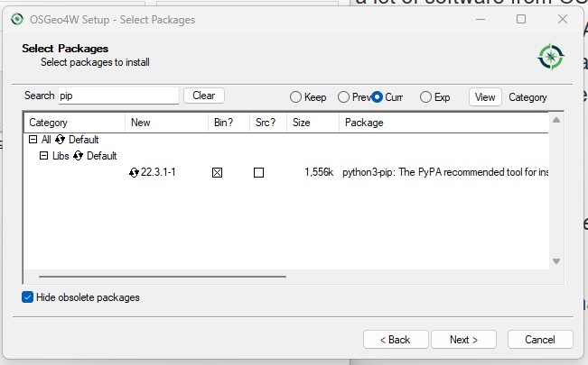
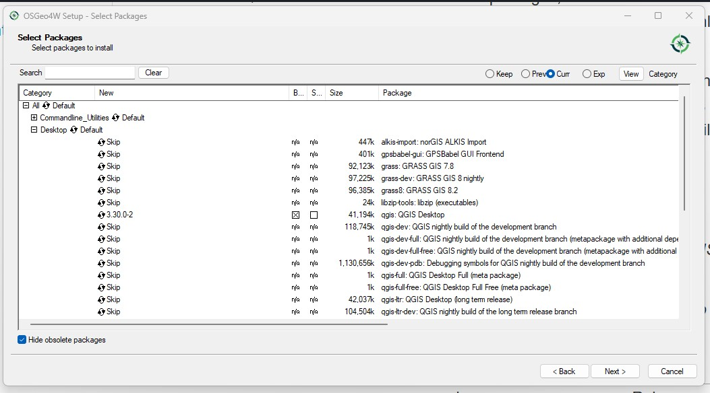
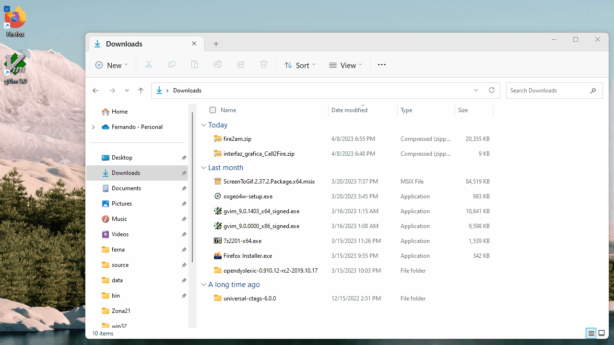
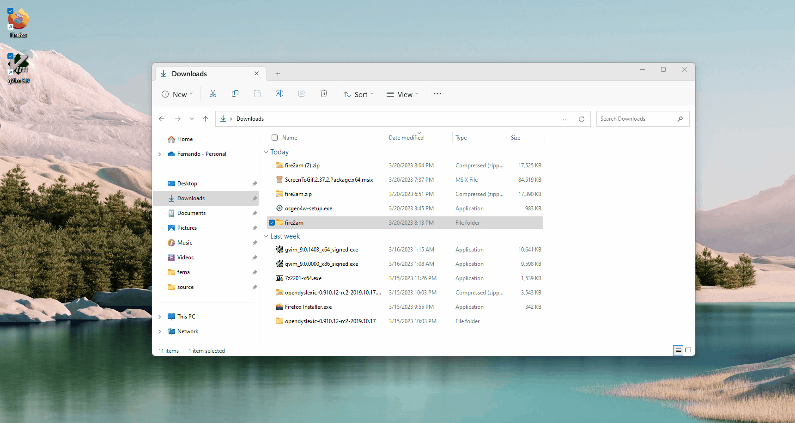
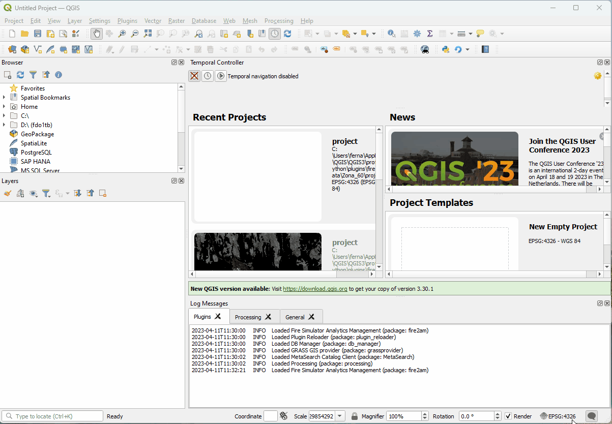

        Fire Advanced Analytics & Management
        
                 fire2am QGIS plugin
                
            by fire2a.com research centre

This repo contains a  [QGIS plugin](https://plugins.qgis.org/) for graphically interfacing with [Cell2Fire Scott & Burgan](https://github.com/fire2a/C2FSB) forest fires simulator, test cases and a few extras.  

This softwares enables you to simulate thousand of forest fires on a landscape using [QGIS](https://qgis.org). 

With the bare minumiun input being a fuel and elevation layer. Other spatial inputs can include canopy base height, bulk density or fraction cover; ignition points, weather scenarios, moisture content, etc.

Can provide several outputs, such as Fire scars: starting point, animated isochrones, burn probability maps. Crown fire scar and fuel consumption. Flame lenght, Byram intensity, Hit Rate of Spread, etc.

[Install](Installation) then, choose your guide:
- [User](readme_user.md)
- [Expert](readme_dev.md)

# Installation
Overview (keep reading don't do this right away):
- pip install python required packages (on QGIS python environment)
- move the source folder to QGIS's plugins directory
- activate inside QGIS

Choose your platform:
- [Windows](A.Windows)
- [Linux or MacOS](B.Linux)

## A.Windows
If you don't want to reinstall QGIS and understood the [overview](Installation), you can [manually install](Windows_manual).  
 1. Install QGIS, using OSGeo4W net installer  
    - https://qgis.org/en/site/forusers/alldownloads.html#osgeo4w-installer  
    - Use default options for everything but
    - Select packages to install "QGIS desktop" & "pip"
 2. At least open and close QGIS once
 3. Download & un7zip the latest [release](https://github.com/fdobad/fire2am-qgis-plugin/releases) into `fire2am` (default suggested name)  
 4. Inside `fire2am`, double click on `installer_windows.bat`, a command prompt will launch and warning dialog will rise.
    - Click on 'More info' > 'Run anyway' on the warning dialog
 5. [Enable the plugin inside QGIS](#activate)

| select package dialog : pip |
| --- |
||
| select package dialog : qgis desktop |
||
| extracting zip, clicking installer_windows.bat, avoiding useless 'windows protected your pc' dialog |
|  |
| 2nd time doesn't complain, if something fails run installer_debug.bat and let us know what happened |
|  |

### Windows_manual 
- launch osgeo installer > install pip component
- launch osgeo console > pip install --upgrade pip setuptools wheel & pip install -r C:\path\to\fire2am\requirements.txt
- move the source folder into QGIS's plugins directory %APPDATA%\QGIS\QGIS3\profiles\default\python\plugins\fire2am
- [Enable the plugin inside QGIS](#activate)

## B.Linux
0. Install QGIS  
    - Debian LTR version: Super Key > type 'QGIS' > Click Install
    - Others: https://qgis.org/en/site/forusers/alldownloads.html#linux
1. Donwload a release, unzip into the plugins folder `~/.local/share/QGIS/QGIS3/profiles/default/python/plugins/fire2am`
2. `cd` into it  
3. Python requirements  
    ```
    pip install --upgrade pip wheel setuptools
    pip install -r requirements.txt
    ```  
    __Optionally__ a virtual environment can be used, but you must remember to activate it before launching QGIS, for example `$ source ~/pyenv/qgis/bin/activate && qgis` or disabling the plugin to avoid getting the `Module not Found` errors at startup.  

4. A Cell2Fire c++ simulator binary is provided, but is better to compile it  
    ```
    cd C2FSB/Cell2FireC
    sudo apt install g++ libboost-all-dev libeigen3-dev
    make 
    ```  
    
    If it fails check where your distribution installs eigen. Because the `makefile` assumes `EIGENDIR = /usr/include/eigen3/`  
    Locate it with `nice find / -readable -type d -name eigen3 2>/dev/null`  
    Then edit `makefile` accordingly & try again.  

5. [Enable the plugin inside QGIS](#activate)  

## Like and subscribe to get the latest releases


## Activate
1. QGIS Menu > Plugins > Manage and Install Plugins > All  
2. type 'fire', select 'Fire Simulator Analytics Management'  
3. click 'Install Plugin'  
Now you have a new icon  on the plugin toolbar and a new plugin menu.  

| activation |
| --- |
||

Now you have a new icon  on the plugin toolbar and a new plugin menu.  

# Broadest Usage Overview  
0. Open & save a qgis project  
1. At least have a fuel raster layer in ascii AAIGrid format, according to Scott & Burgan fuels [definition](spain_lookup_table.csv)  
2. Set project & layers CRS (Coordinate Reference System)  
3. Open the dialog (the plugin icon), setup the layers, ignitions, weather on each tab. Click Run!  
4. Wait for the simulation (& postprocessing, although this is done on the background)  
5. Main results will be added as layers (also a folder to reproduce and store all results is made)  

Sample instances are included in the plugin folder `fire2am/C2FSB/data/`  
Keep reading and then make sure to check the [user guide](readme_user.md)  

# Screenshot  
  

0. On the Plugin Menu this plugin is shown selected  
1. Its icon is also available on the Plugin Toolbar   
2. Along other very useful plugins:  
    - Plugin Builder : For developers wanting a minimal working plugin template  
    - Plugin Reloader : If the provided Restore Defaults button doesn't work, use this  
    - Time Manager : For earlier versions of QGIS (<3.2) this is needed for animating the fire isochrones (merged fire evolution layer)  
    - IPython QGIS Console : A introspection capable ipython session based on qtconsole  

# Known issues  
- Directories or folders with spaces won't work
- Don't close the current project with the dialogs opened  
- Don't try opening the results directory or geopackage databases (.gpkg) while the simulation is running or while postprocessing  
- Windows version fails around 3564288 cells  

A cup-of-coffee run length is less than 1000x1000 raster with 100 simulations (the load can be adjusted via number of threads on optional rules tab) 

# Keep on reading
- [User guide](readme_user.md)
- [Expert guide](readme_dev.md)
